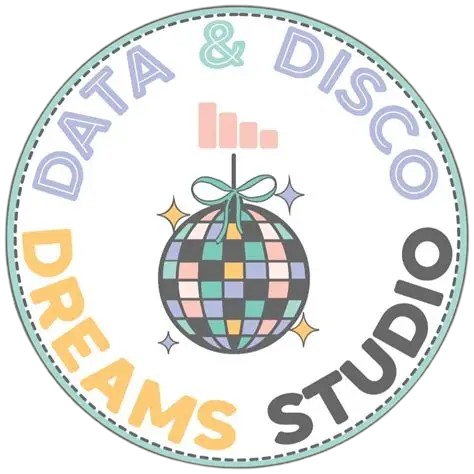

# DecTell AI — Decision Intelligence Platform

<!-- 📸 ADD IMAGE HERE: Project banner/hero screenshot (recommended: 1280x640px)
     Save as: assets/banner.png  then uncomment the line below:
      -->

> An AI-powered Business Analytics & Decision Intelligence platform built with Python and Streamlit.
> Upload any dataset, get LLM-generated insights, train ML models, simulate decisions, and chat with your data — all in one place.

---

## 🚀 Live Demo

<!-- 📸 ADD BADGE HERE: Once deployed on Streamlit Cloud, replace YOUR-APP-NAME below
     [](https://YOUR-APP-NAME.streamlit.app) -->

---

## 📸 Screenshots

<!-- 📸 ADD IMAGE HERE: Home page screenshot
     Save as: assets/screenshots/home.png  then uncomment:
      -->

<!-- 📸 ADD IMAGE HERE: AI Analyze page screenshot
     Save as: assets/screenshots/ai_analyze.png  then uncomment:
      -->

<!-- 📸 ADD IMAGE HERE: Scenario Simulation screenshot
     Save as: assets/screenshots/simulation.png  then uncomment:
      -->

<!-- 📸 ADD IMAGE HERE: Chat with Data screenshot
     Save as: assets/screenshots/chat.png  then uncomment:
      -->

---

## Features

| Module | Description |
|--------|-------------|
| **Smart Data Upload** | AI-driven cleaning — imputes, encodes, caps outliers only when needed |
| **Automated EDA** | Distribution charts, correlation heatmaps, LLM-generated narrative insights |
| **AI Analyze** | Business mode (plain language goals) + Technical mode (full ML control) |
| **Scenario Simulation** | What-if sliders and dropdowns for any dataset type including categoricals |
| **Causal Impact** | Difference-in-Differences with bootstrapped 95% confidence intervals |
| **Chat with Data** | Groq LLM conversational interface with full session memory |
| **Report Generator** | AI-written Business and Technical reports exportable as PDF or text |
| **Analytics Dashboard** | Live KPIs, model metrics, feature importances |
| **Developer Page** | Professional profile of the developer |

---

## Tech Stack

- **Language:** Python 3.12
- **Framework:** Streamlit
- **AI Engine:** Groq API with llama-3.3-70b-versatile
- **ML:** Scikit-learn, XGBoost
- **Data:** Pandas, NumPy
- **Visualisation:** Plotly
- **PDF Export:** ReportLab
- **Integration:** Google Sheets API

---

## Project Structure

```
dectell-ai/
├── app.py                        <- Entry point
├── requirements.txt
├── README.md
├── .gitignore
├── .streamlit/
│   ├── config.toml               <- Theme config (committed)
│   └── secrets.toml              <- NOT committed — add your keys here locally
├── assets/
│   ├── logo.png
│   ├── favicon.png
│   └── vivek_photo.jpg           <- Add your photo manually
├── pages/
│   ├── Home.py
│   ├── About.py
│   ├── Contact.py
│   ├── Upload.py
│   ├── EDA.py
│   ├── AIAnalyze.py
│   ├── Simulation.py
│   ├── Causal.py
│   ├── Chat.py
│   ├── Report.py
│   ├── Dashboard.py
│   └── Developer.py
├── modules/
│   ├── data_cleaning.py
│   ├── eda_analysis.py
│   ├── causal_analysis.py
│   └── report_generator.py
├── utils/
│   ├── data_utils.py
│   ├── model_utils.py
│   ├── llm_utils.py
│   ├── visualization_utils.py
│   ├── chat_utils.py
│   └── ui_utils.py
└── sample_datasets/
    ├── retail_sales.csv
    ├── customer_churn.csv
    ├── marketing_campaign.csv
    ├── ecommerce_transactions.csv
    ├── hr_analytics.csv
    ├── financial_timeseries.csv
    └── healthcare_patients.csv
```

---

## Local Setup

### 1. Clone the repository

```bash
git clone https://github.com/your-username/dectell-ai.git
cd dectell-ai
```

### 2. Install dependencies

```bash
pip install -r requirements.txt
```

### 3. Add your secrets

Create `.streamlit/secrets.toml` locally — this file is gitignored and never pushed:

```toml
GROQ_API_KEY       = "gsk_your_groq_api_key_here"
SHEETS_WEBHOOK_URL = "https://script.google.com/macros/s/YOUR_SCRIPT_ID/exec"
```

Get your free Groq API key at [console.groq.com](https://console.groq.com)

### 4. Run the app

```bash
streamlit run app.py
```

---

## Secrets Reference

| Key | Where to get it | Required |
|-----|----------------|----------|
| `GROQ_API_KEY` | [console.groq.com](https://console.groq.com) — free tier available | Yes — for all AI features |
| `SHEETS_WEBHOOK_URL` | Google Apps Script deployment URL from your spreadsheet | No — only for contact and feedback forms |

---

## Deploy on Streamlit Cloud

1. Push this repo to GitHub
2. Go to [share.streamlit.io](https://share.streamlit.io)
3. Click **New app** and select your repo
4. Set main file as `app.py`
5. Under **Advanced settings → Secrets** paste your secrets in TOML format
6. Click **Deploy**

---

## Partner

<!-- 📸 ADD IMAGE HERE: Data & Disco Dreams Studio logo
     Save as: assets/datadisco_logo.png  then uncomment:
      -->

**[Data & Disco Dreams Studio](https://www.datadiscodreams.com)**
Data Consulting & Design for Small Businesses | Atlanta, United States

---

## Developer

<!-- 📸 ADD IMAGE HERE: Your profile photo
     Save as: assets/vivek_photo.jpg  then uncomment:
      -->

**Vivek Singh**
MCA — Big Data & Analytics | Jaypee Institute of Information Technology, Noida

- LinkedIn: [vivek-singh-linkdin](https://www.linkedin.com/in/vivek-singh-linkdin)
- GitHub: [vivek081202](https://github.com/vivek081202)
- Email: vivekkrsingh082003@gmail.com

---

## Licence

MIT — Free to use, modify, and distribute.

---

*DecTell AI — Built with research, analytics, and intelligence.*
